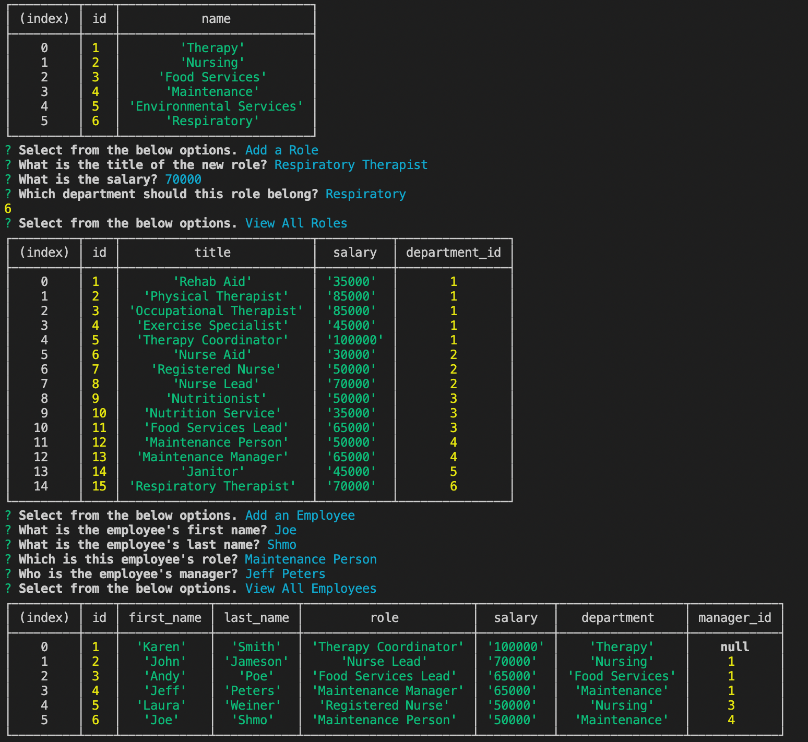
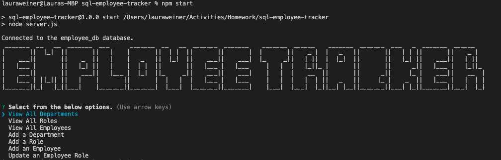

# Employee Tracker

## Table of Contents
- [Description](#Description)
- [Usage](#Usage)
- [Walkthrough](#Walkthrough)
- [Screenshot](#Screenshot)
- [License](#License)
- [Languages](#Languages)
- [Questions](#Questions)

## Description
This application creates interfaces that allow non-developers to easily view and interact with information stored in an employee database. Through a command-line application the user can manage a company's employee database that pulls from three inner connected tables, Department, Role and Employee.

## Usage
To quickly update an employee ID via the command line. 

## Walkthrough
[Link to Video](https://watch.screencastify.com/v/fe56pO0RhFpJrYdgFY60)

## Screenshot

-------

## License
MIT 

## Languages
JavaScript, node.js, inquirer and MySQL2

## Questions
Please contact me at lauraRweiner@gmail.com if you have any questions or suggestions.